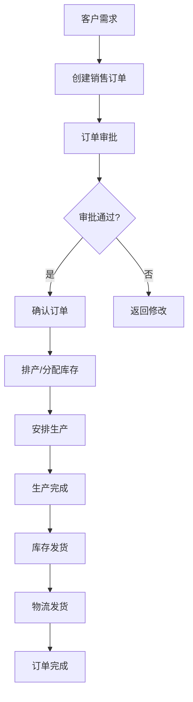
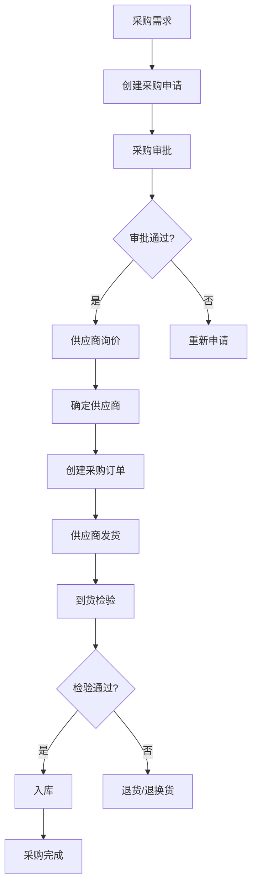
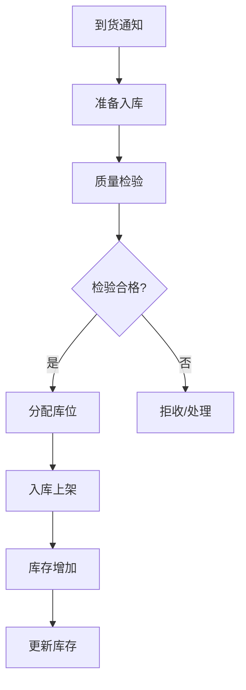
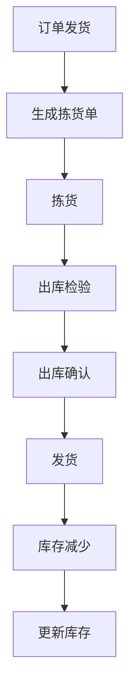
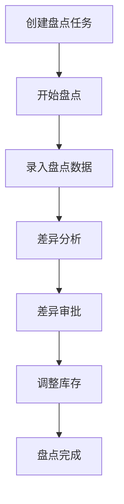
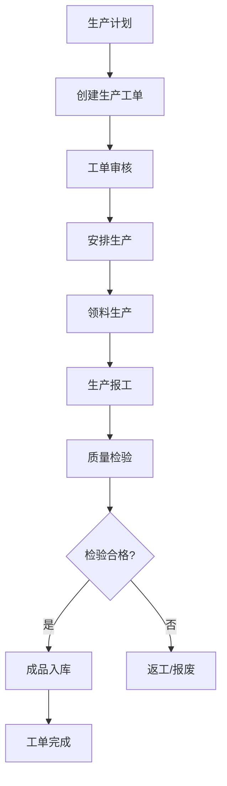
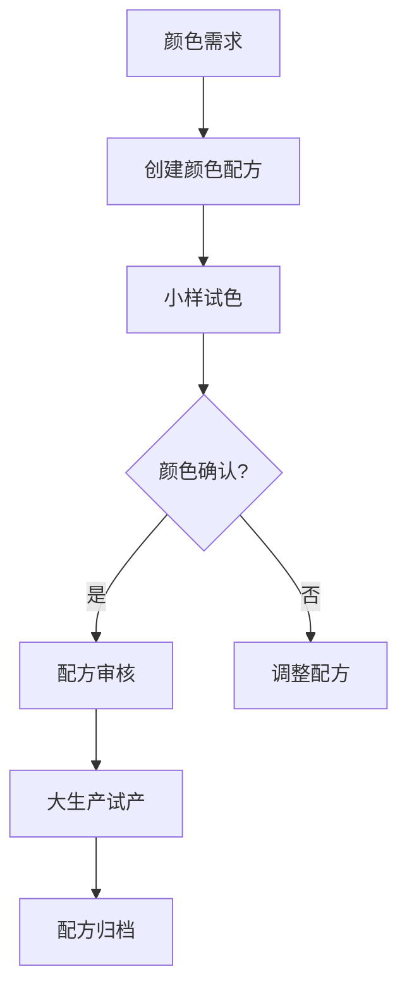
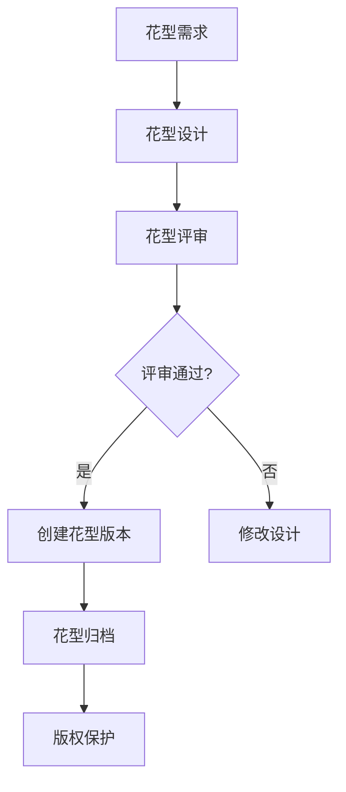
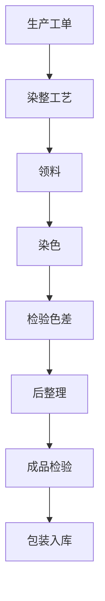

# 核心业务流程文档

> **版本**：1.0.0  
> **日期**：2025-06-06

---

## 目录
1. [销售订单流程](#1-销售订单流程)
2. [采购流程](#2-采购流程)
3. [库存管理流程](#3-库存管理流程)
4. [生产管理流程](#4-生产管理流程)
5. [面料特色流程](#5-面料特色流程)

---

## 1. 销售订单流程

### 1.1 标准销售订单流程

### 1.2 销售订单详细流程

| 步骤 | 操作 | 说明 | 责任方 |
|------|------|--------|
| 1 | 客户下单 | 客户通过线上或线下方式下单 | 客户/销售员 |
| 2 | 创建订单 | 在系统中创建销售订单，选择产品、颜色、数量 | 销售员 |
| 3 | 订单审批 | 根据金额大订单需要审批 | 销售主管 |
| 4 | 确认订单 | 确认订单信息，锁定库存 | 销售员 |
| 5 | 生产计划 | 根据订单安排生产计划 | 生产计划员 |
| 6 | 生产执行 | 安排生产任务，进行生产 | 生产车间 |
| 7 | 质量检验 | 生产完成后进行检验 | 质检员 |
| 8 | 安排发货 | 检验通过后安排发货 | 仓库管理员 |
| 9 | 物流发货 | 联系物流公司发货 | 物流专员 |
| 10 | 订单完成 | 客户收货确认 | 销售员 |

---

## 2. 采购流程

### 2.1 标准采购流程

---

## 3. 库存管理流程

### 3.1 入库流程

### 3.2 出库流程

### 3.3 盘点流程

---

## 4. 生产管理流程

### 4.1 生产工单流程

---

## 5. 面料特色流程

### 5.1 颜色配方管理流程

### 5.2 花型设计管理流程

### 5.3 批次生产流程（染整工艺）

---
