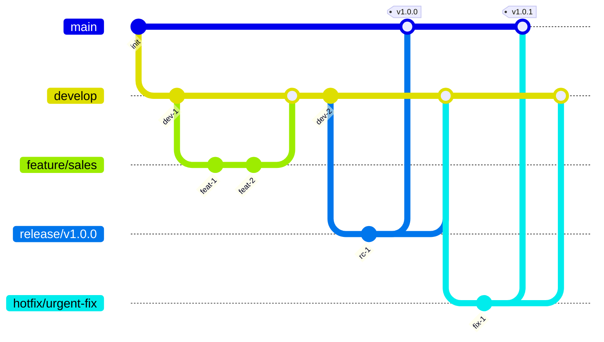
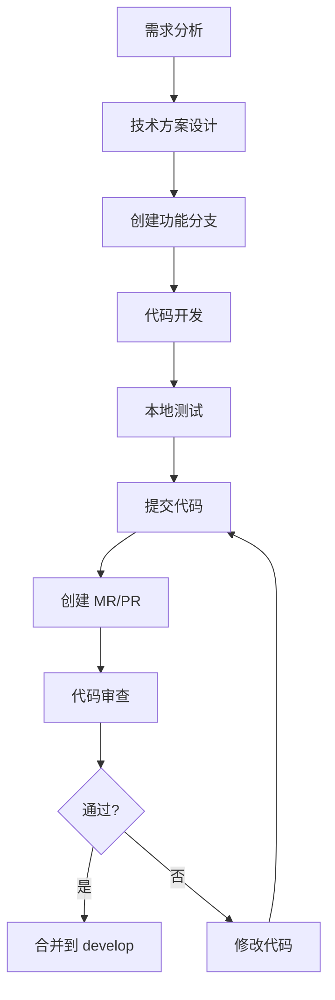
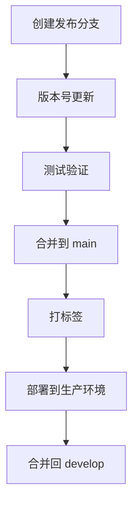

# 开发流程与规范文档

> **版本**：1.0.0  
> **日期**：2025-06-06

---

## 目录
1. [Git 分支策略](#1-git-分支策略)
2. [代码规范](#2-代码规范)
3. [开发工作流](#3-开发工作流)
4. [代码审查](#4-代码审查)
5. [版本发布](#5-版本发布)

---

## 1. Git 分支策略

### 1.1 分支命名规范

| 分支类型 | 命名规范 | 说明 |
|----------|---------|------|
| 主分支 | `main` | 生产环境代码 |
| 开发分支 | `develop` | 开发环境代码 |
| 功能分支 | `feature/feature-name` | 新功能开发 |
| 修复分支 | `fix/bug-name` | Bug 修复 |
| 发布分支 | `release/v1.0.0` | 版本发布 |
| 热修复分支 | `hotfix/hotfix-name` | 生产环境紧急修复 |

### 1.2 Git 工作流



### 1.3 提交信息规范

```bash
# 格式
<type>(<scope>): <subject>

# 类型
feat: 新功能
fix: 修复 bug
docs: 文档修改
style: 代码格式调整
refactor: 重构
test: 测试相关
chore: 构建/工具链

# 示例
feat(sales): 添加销售订单导出功能
fix(inventory): 修复库存扣减并发问题
docs(readme): 更新部署文档
```

---

## 2. 代码规范

### 2.1 前端代码规范

```typescript
// TypeScript 命名规范
// 类型、接口、类：PascalCase
interface Product {}
class ProductService {}

// 函数、变量：camelCase
function getProduct() {}
const userName = 'admin';

// 常量：UPPER_SNAKE_CASE
const MAX_RETRY = 3;

// 文件命名：kebab-case
// product-service.ts
// product-list.component.ts
```

### 2.2 后端代码规范

```typescript
// NestJS 模块组织
/src
  /modules
    /sales
      /dto
        create-sales-order.dto.ts
      /entities
        sales-order.entity.ts
      /repositories
        sales-order.repository.ts
      /services
        sales-order.service.ts
      /controllers
        sales-order.controller.ts
      sales.module.ts
```

---

## 3. 开发工作流

### 3.1 标准开发流程



---

## 4. 代码审查

### 4.1 审查清单

- [ ] 代码符合项目规范
- [ ] 已添加必要的单元测试
- [ ] 没有引入安全漏洞
- [ ] 没有性能问题
- [ ] API 文档已更新
- [ ] 数据库迁移已验证

---

## 5. 版本发布

### 5.1 发布流程



---
