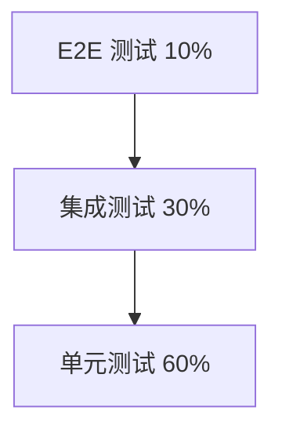

# 测试策略文档

> **版本**：1.0.0  
> **日期**：2025-06-06

---

## 目录
1. [测试金字塔](#1-测试金字塔)
2. [单元测试](#2-单元测试)
3. [集成测试](#3-集成测试)
4. [端到端测试](#4-端到端测试)
5. [性能测试](#5-性能测试)
6. [测试覆盖率](#6-测试覆盖率)

---

## 1. 测试金字塔



---

## 2. 单元测试

### 2.1 前端单元测试（Jest）

```typescript
// product.service.spec.ts
import { TestBed } from '@angular/core/testing';
import { ProductService } from './product.service';
import { HttpClientTestingModule } from '@angular/common/http/testing';

describe('ProductService', () => {
  let service: ProductService;

  beforeEach(() => {
    TestBed.configureTestingModule({
      imports: [HttpClientTestingModule],
      providers: [ProductService]
    });
    service = TestBed.inject(ProductService);
  });

  it('should be created', () => {
    expect(service).toBeTruthy();
  });

  it('should get product list', (done) => {
    service.getProducts().subscribe(products => {
      expect(products.length).toBeGreaterThan(0);
      done();
    });
  });
});
```

### 2.2 后端单元测试（Jest）

```typescript
// sales-order.service.spec.ts
import { Test, TestingModule } from '@nestjs/testing';
import { SalesOrderService } from './sales-order.service';
import { getRepositoryToken } from '@nestjs/typeorm';
import { SalesOrder } from './entities/sales-order.entity';

describe('SalesOrderService', () => {
  let service: SalesOrderService;
  const mockRepository = {
    create: jest.fn(),
    save: jest.fn(),
    find: jest.fn(),
    findOne: jest.fn()
  };

  beforeEach(async () => {
    const module: TestingModule = await Test.createTestingModule({
      providers: [
        SalesOrderService,
        {
          provide: getRepositoryToken(SalesOrder),
          useValue: mockRepository
        }
      ]
    }).compile();

    service = module.get<SalesOrderService>(SalesOrderService);
  });

  it('should be defined', () => {
    expect(service).toBeDefined();
  });

  it('should create sales order', async () => {
    const dto = { /* test data */ };
    mockRepository.save.mockResolvedValue(dto);
    
    const result = await service.create(dto);
    expect(result).toEqual(dto);
    expect(mockRepository.save).toHaveBeenCalledWith(dto);
  });
});
```

---

## 3. 集成测试

### 3.1 API 集成测试

```typescript
// 销售订单 API 集成测试
describe('SalesOrder API (e2e)', () => {
  let app: INestApplication;

  beforeAll(async () => {
    const moduleFixture = await Test.createTestingModule({
      imports: [AppModule]
    }).compile();

    app = moduleFixture.createNestApplication();
    await app.init();
  });

  it('/api/v1/sales-orders (POST)', () => {
    return request(app.getHttpServer())
      .post('/api/v1/sales-orders')
      .set('Authorization', 'Bearer test-token')
      .send({
        customerId: 'test-customer-id',
        orderDate: new Date().toISOString(),
        items: [{
          productId: 'test-product-id',
          quantity: 100,
          unit: 'meter',
          unitPrice: 50
        }]
      })
      .expect(201)
      .expect(res => {
        expect(res.body.success).toBe(true);
        expect(res.body.data).toHaveProperty('id');
      });
  });

  afterAll(async () => {
    await app.close();
  });
});
```

---

## 4. 端到端测试

### 4.1 Playwright E2E 测试

```typescript
// sales-order.spec.ts
import { test, expect } from '@playwright/test';

test.describe('Sales Order Flow', () => {
  test('should create sales order', async ({ page }) => {
    // 登录
    await page.goto('/login');
    await page.fill('#username', 'admin');
    await page.fill('#password', 'password');
    await page.click('button[type="submit"]');
    
    // 导航到销售订单页面
    await page.goto('/sales-orders');
    await page.click('button:has-text("新建订单")');
    
    // 填写订单信息
    await page.selectOption('#customerId', 'test-customer');
    await page.fill('#orderDate', '2025-06-06');
    
    // 添加产品
    await page.click('button:has-text("添加产品")');
    await page.selectOption('#productId', 'test-product');
    await page.fill('#quantity', '100');
    
    // 提交订单
    await page.click('button:has-text("提交订单")');
    
    // 验证订单创建成功
    await expect(page.locator('.toast-success')).toBeVisible();
  });
});
```

---

## 5. 性能测试

### 5.1 k6 性能测试

```javascript
import http from 'k6/http';
import { check, sleep } from 'k6';

export let options = {
  vus: 100,  // 100 个虚拟用户
  duration: '30s',  // 持续 30 秒
};

export default function () {
  // 测试产品列表查询性能
  let res = http.get('http://api.example.com/api/v1/products', {
    headers: {
      'Authorization': 'Bearer test-token',
    },
  });
  
  check(res, {
    'status is 200': (r) => r.status === 200,
    'response time < 200ms': (r) => r.timings.duration < 200,
  });
  
  sleep(1);
}
```

---

## 6. 测试覆盖率

### 6.1 覆盖率目标

| 类型 | 目标覆盖率 | 说明 |
|------|-----------|------|
| 语句覆盖率 | ≥ 80% | 执行的语句比例 |
| 分支覆盖率 | ≥ 70% | 覆盖的条件分支比例 |
| 函数覆盖率 | ≥ 80% | 调用的函数比例 |
| 行覆盖率 | ≥ 80% | 执行的代码行比例 |

---
