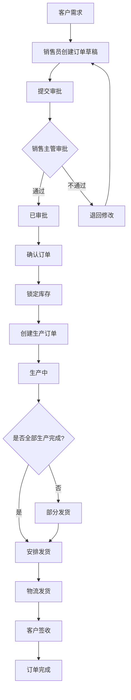
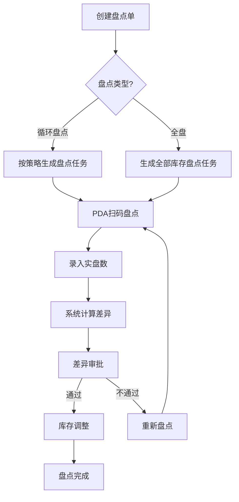
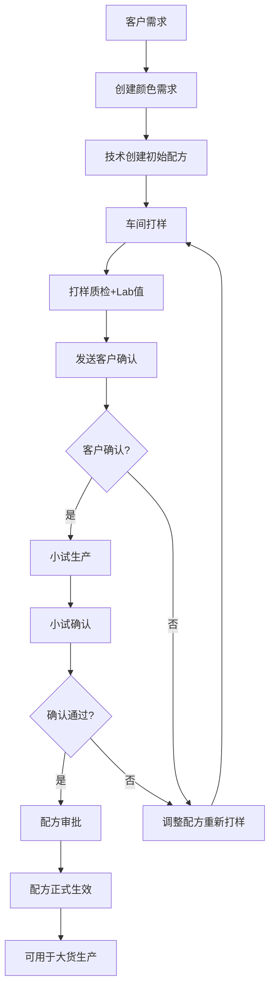

# 纺织面料ERP系统 需求规格说明书

> **版本**：v1.0  
> **日期**：2026-06-06  
> **状态**：待审核

---

## 目录

1. [项目概述](#1-项目概述)
2. [功能需求](#2-功能需求)
   - [2.1 销售管理模块](#21-销售管理模块)
   - [2.2 库存管理模块](#22-库存管理模块)
   - [2.3 颜色配方和花型管理](#23-颜色配方和花型管理)
   - [2.4 财务管理模块](#24-财务管理模块)
   - [2.5 系统集成和移动应用](#25-系统集成和移动应用)
3. [业务流程](#3-业务流程)
4. [数据需求](#4-数据需求)
5. [非功能需求](#5-非功能需求)
6. [验收标准](#6-验收标准)

---

## 1. 项目概述

### 1.1 项目背景
为针织面料企业构建一个全功能、高准确性、高性能的企业级ERP系统，覆盖销售、采购、库存、生产、质量、财务、设备等核心业务模块。

### 1.2 项目目标
- 支持百万级数据量，响应时间<200ms
- 确保数据唯一性和准确性
- 支持面料行业特色功能（颜色配方、花型管理、批次管理）
- 实现业务流程数字化和标准化

### 1.3 关键决策记录

| 编号 | 决策内容 | 选项 |
|------|---------|------|
| DC01 | 销售订单审批流程 | C. 统一审批，所有订单都需要销售主管审批 |
| DC02 | 销售订单状态流 | B. 详细状态（8个步骤） |
| DC03 | 批次管理方式 | A. 严格批次，每个染缸/批次单独管理 |
| DC04 | 库存盘点方式 | C. 循环盘点 + 定期全盘 |
| DC05 | 出库拣货策略 | C. 默认FIFO，但可以指定批次 |
| DC06 | 颜色配方管理 | B. 标准版本，版本管理 + 审批 |
| DC07 | 花型版权管理 | C. 完整版权管理 |
| DC08 | 颜色打样流程 | C. 完整流程 |
| DC09 | 财务模块范围 | C. 完整财务（成本核算+利润分析+预算） |
| DC10 | 报表需求范围 | B. 标准报表（销售+采购+库存+财务+生产+质量） |
| DC11 | 成本核算方式 | C. 实际成本（先进先出/移动加权平均） |
| DC12 | 系统集成需求 | C. 标准集成（MES、WMS、电商平台等） |
| DC13 | 移动应用需求 | C. 全功能移动App |
| DC14 | 权限管理粒度 | C. 精细权限（角色+模块+字段+数据权限） |

---

## 2. 功能需求

### 2.1 销售管理模块

#### 2.1.1 销售订单管理

**功能描述**：销售订单的创建、审批、确认、发货、完成全流程管理。

**详细需求**：

| 序号 | 需求点 | 优先级 | 描述 |
|------|-------|------|------|
| SO001 | 订单创建 | P0 | 支持创建销售订单，选择客户、产品、颜色、数量、单价 |
| SO002 | 订单编码 | P0 | 自动生成唯一订单编号（规则：SO-YYYYMMDD-0001） |
| SO003 | 订单状态流转 | P0 | 严格按状态流：草稿 → 待审批 → 已审批 → 已确认 → 生产中 → 部分发货 → 已发货 → 完成 |
| SO004 | 统一审批流程 | P0 | **所有订单都必须经过销售主管审批**才能继续 |
| SO005 | 颜色配方关联 | P0 | 订单明细行可关联颜色配方和具体批次 |
| SO006 | 订单变更 | P1 | 支持订单变更记录和版本管理 |
| SO007 | 客户采购单号 | P1 | 记录客户采购订单号（PO Number） |
| SO008 | 交期管理 | P1 | 记录预计交期和实际交期 |
| SO009 | 订单查询 | P1 | 按客户、日期、状态、产品等多维度查询 |
| SO010 | 订单导出 | P2 | 支持导出Excel/PDF |

**状态流转规则**：

```
草稿 (draft) → 待审批 (pending_approval)
    ↓ (销售主管审批)
已审批 (approved) → 已确认 (confirmed)
    ↓ (关联生产订单)
生产中 (in_production) → 部分发货 (partially_shipped)
    ↓ (全部发货)
已发货 (shipped) → 完成 (completed)
```

**业务规则**：
- 订单状态不可逆，只能向前流转
- 审批不通过时，订单退回到草稿状态，可编辑重新提交
- 生产中的订单不能修改产品明细，只能修改交期、备注等非核心信息

---

### 2.2 库存管理模块

#### 2.2.1 批次管理

**功能描述**：严格批次管理，每个染缸/批次单独管理。

| 序号 | 需求点 | 优先级 | 描述 |
|------|-------|------|------|
| BM001 | 批次创建 | P0 | 创建批次时需记录：批次号、缸号、产品、颜色配方、数量、生产日期、Lab值、质量状态 |
| BM002 | 批次唯一性 | P0 | 批次号唯一（规则：B-YYYYMMDD-0001），按工厂+类型+编号组合唯一 |
| BM003 | 库存分离 | P0 | **各批次库存严格分离**，库存表按（仓库+产品+批次）为唯一键 |
| BM004 | 批次标签 | P1 | 支持生成批次标签（含二维码/条形码） |
| BM005 | 批次追溯 | P1 | 可追溯批次的完整流向（采购→入库→质检→库存→出库→销售→客户） |
| BM006 | 批次质量 | P1 | 记录批次质检结果、Lab值、色差ΔE |

#### 2.2.2 库存盘点

**功能描述**：支持循环盘点和定期全盘。

| 序号 | 需求点 | 优先级 | 描述 |
|------|-------|------|------|
| IV001 | 循环盘点 | P0 | 每天/周对部分物料进行盘点，可配置盘点策略（按ABC分类、周转率等） |
| IV002 | 定期全盘 | P0 | 支持月底/季度/年度全盘，生成盘点单 |
| IV003 | 差异分析 | P1 | 盘点后自动计算差异，生成差异报告 |
| IV004 | 差异调整 | P1 | 库存差异需审批后才能调整库存 |
| IV005 | 盘点记录 | P2 | 保留完整的盘点历史记录 |

#### 2.2.3 出库策略

**功能描述**：默认先进先出，但可指定批次发货。

| 序号 | 需求点 | 优先级 | 描述 |
|------|-------|------|------|
| OS001 | FIFO策略 | P0 | 默认采用先进先出策略，系统自动推荐最早的批次 |
| OS002 | 指定批次 | P0 | **允许用户在发货时指定具体批次** |
| OS003 | 颜色优先 | P1 | 考虑颜色匹配度，优先推荐色差ΔE最小的批次 |
| OS004 | 批次锁 | P1 | 创建发货单时锁定库存，防止超卖 |

---

### 2.3 颜色配方和花型管理

#### 2.3.1 颜色配方管理

**功能描述**：版本管理 + 审批流程。

| 序号 | 需求点 | 优先级 | 描述 |
|------|-------|------|------|
| CF001 | 配方创建 | P0 | 创建颜色配方，记录产品、色号、颜色名称、Pantone号、配方数据（染料比例） |
| CF002 | 版本管理 | P0 | **配方有版本号**，每次修改自动生成新版本 |
| CF003 | 审批流程 | P0 | **配方必须经过审批后才能用于生产** |
| CF004 | Lab值记录 | P1 | 记录L/a/b色值，支持Lab值对比 |
| CF005 | 历史配方库 | P1 | 支持历史配方查询和复用 |
| CF006 | 配方状态 | P1 | 状态包括：草稿 → 待审批 → 已审批 → 废弃 |

#### 2.3.2 花型版权管理

**功能描述**：完整的版权管理。

| 序号 | 需求点 | 优先级 | 描述 |
|------|-------|------|------|
| PT001 | 版权信息 | P0 | 记录版权所有者、授权范围、有效期 |
| PT002 | 客户授权 | P0 | **记录授权给哪些客户** |
| PT003 | 版权使用费 | P0 | **追踪版权使用费**，包括应付/已付金额、支付记录 |
| PT004 | 花型版本 | P1 | 花型支持版本管理，保存多个设计版本 |
| PT005 | 花型文件 | P1 | 上传花型设计文件（AI/PSD等）和缩略图 |
| PT006 | 版权预警 | P2 | 版权即将到期时自动预警 |

#### 2.3.3 颜色打样流程

**功能描述**：完整的6步打样流程。

| 步骤 | 状态 | 描述 | 责任方 |
|------|------|------|-------|
| 1 | 客户需求 | 记录客户颜色需求、色卡、参考样 | 销售员 |
| 2 | 配方创建 | 技术部门创建初始颜色配方 | 技术员 |
| 3 | 打样 | 车间打小样，记录Lab值 | 打样员 |
| 4 | 客户确认 | 发送色卡给客户确认，记录反馈 | 销售员 |
| 5 | 小试 | 客户确认后，进行小批量试产 | 生产部 |
| 6 | 确认 | 小试确认后，配方正式生效，可用于大货生产 | 技术主管 |

---

### 2.4 财务管理模块

#### 2.4.1 完整财务功能

| 序号 | 功能点 | 优先级 | 描述 |
|------|-------|------|------|
| FM001 | 应收管理 | P0 | 应收账款、应收发票、收款单、对账、账龄分析 |
| FM002 | 应付管理 | P0 | 应付账款、应付发票、付款单、对账 |
| FM003 | 凭证管理 | P0 | 会计凭证、凭证审核、凭证记账 |
| FM004 | 总账 | P0 | 科目余额表、明细账、总账、试算平衡表 |
| FM005 | **成本核算** | P0 | **按批次进行实际成本核算** |
| FM006 | **利润分析** | P0 | **产品利润、客户利润、订单利润、部门利润分析** |
| FM007 | **预算管理** | P0 | **预算编制、预算执行、预算分析** |

#### 2.4.2 成本核算方式

**实际成本法，支持两种核算方式**：
1.  **先进先出（FIFO）** - 按入库顺序计算出库成本
2.  **移动加权平均** - 每次入库后重新计算平均成本

默认推荐使用**移动加权平均法**，系统可配置。

#### 2.4.3 标准报表

| 报表分类 | 具体报表 |
|---------|---------|
| **销售报表** | 销售订单统计表、客户销售分析、产品销售分析、销售员业绩表、销售趋势分析 |
| **采购报表** | 采购订单统计表、供应商采购分析、产品采购分析、采购员业绩表 |
| **库存报表** | 库存明细表、库存周转率、库存预警表、库龄分析表、ABC分类报表 |
| **财务报表** | 资产负债表、利润表、现金流量表、应收账龄表、应付账龄表 |
| **生产报表** | 生产订单统计表、工单进度表、设备利用率、生产效率分析 |
| **质量报表** | 质检统计表、批次合格率、质量问题分析、质量改善追踪 |

---

### 2.5 系统集成和移动应用

#### 2.5.1 系统集成

| 序号 | 集成对象 | 优先级 | 描述 |
|------|---------|------|------|
| IT001 | MES系统 | P0 | 与制造执行系统集成，获取生产进度、质量数据 |
| IT002 | WMS系统 | P0 | 与仓库管理系统集成，同步库存数据、出入库指令 |
| IT003 | 电商平台 | P1 | 与电商平台集成（1688、淘宝等），同步订单、库存 |
| IT004 | 开放API | P1 | 提供RESTful API接口，支持第三方系统对接 |

#### 2.5.2 全功能移动App

| 模块 | 功能 |
|------|------|
| **销售App** | 订单查询、客户管理、报价、订单审批通知 |
| **采购App** | 采购订单查询、供应商管理、收货确认 |
| **仓库App** | 扫码入库、扫码出库、盘点（PDA模式）、库存查询 |
| **老板看板** | 销售数据、库存数据、生产数据、财务数据的实时仪表盘 |

#### 2.5.3 精细权限管理

权限维度：**4层权限控制**

1.  **角色权限** - 预定义角色（管理员、销售员、采购员、仓管员、财务等）
2.  **模块权限** - 控制用户可访问哪些模块
3.  **字段权限** - 控制用户可查看/编辑哪些字段（敏感字段隐藏）
4.  **数据权限** - 控制用户可查看哪些数据：
    - 按部门（仅本部门数据）
    - 按客户（仅负责的客户）
    - 按仓库（仅负责的仓库）
    - 按产品类型（仅负责的产品类别）

---

## 3. 业务流程

### 3.1 销售订单流程（详细版）



### 3.2 库存盘点流程



### 3.3 颜色打样流程



---

## 4. 数据需求

### 4.1 核心实体

详细实体定义请参考 [数据库详细设计.md](file:///workspace/docs/specs/02-数据库详细设计.md)。

### 4.2 数据安全要求

- 敏感数据（客户电话、邮箱、银行账号）加密存储
- 数据操作日志记录所有变更
- 定期数据备份（每日+每周+每月）
- 支持数据恢复测试

---

## 5. 非功能需求

### 5.1 性能要求

| 指标 | 要求 |
|------|------|
| 页面响应时间 | < 200ms |
| API响应时间 | < 200ms |
| 并发用户数 | ≥ 100 |
| 数据量支持 | ≥ 100万条记录 |
| 系统可用性 | 99.9% |

### 5.2 安全要求

- 用户密码bcrypt加密存储
- 双因素认证（可选）
- 操作日志完整记录
- 会话超时自动登出
- IP白名单（可选）

### 5.3 可用性要求

- 界面简洁直观，新员工1天内可上手
- 移动端适配良好
- 支持多语言（中文、英文）

---

## 6. 验收标准

### 6.1 功能验收

- ✅ 所有P0需求功能正常
- ✅ 核心业务流程跑通
- ✅ 数据准确无错误

### 6.2 性能验收

- ✅ 响应时间达标（<200ms）
- ✅ 并发测试通过
- ✅ 大数据量测试通过

### 6.3 安全验收

- ✅ 安全扫描无高危漏洞
- ✅ 权限控制验证通过
- ✅ 数据加密验证通过

---

## 附录

### A. 术语表

| 术语 | 解释 |
|------|------|
| 批次 (Batch) | 一个染缸生产的同颜色产品 |
| Lab值 | L（亮度）、a（红绿）、b（黄蓝）颜色坐标 |
| ΔE (Delta E) | 色差，两个颜色之间的距离 |
| FIFO | 先进先出 (First In First Out) |
| Pantone | 国际标准色卡 |
| MES | 制造执行系统 |
| WMS | 仓库管理系统 |

---

**文档状态**：需求收集完成，待审批  
**下一步**：用户确认需求后，进行技术方案设计
